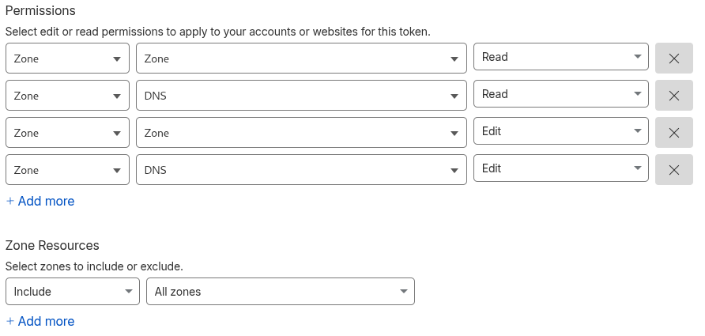

# Traefik

Projeto docker para rodar o traefik com gerenciamento DDNS pela Cloudflare e certificados assinados dinamicamente por LetsEncrypt.

Copie o arquivo `.env_example` renomeando para `.env`.  
Preencha a variável `CF_API_EMAIL` com o email do usuário que gerencia o seu domínio.  
Preencha a variável `DOMAIN` com o domninio gerenciado pela CloudFlare

# CloudFlare

Acesse o painel de [API Tokens](https://dash.cloudflare.com/profile/api-tokens) e clique em `Create Token`.

Preencha  `Permissions` e `Zone Resources` conforme a imagem abaixo:


Clique em `Continue to Summary` e depois em `Create Token`.
Copie o Token de API agora. Ele não será exibido novamente.
Cole o valor do parametro `CF_DNS_API_TOKEN` do arquivo `.env`.

# Senha Dashboard

Execute o comando abaixo no prompt para gerar o hash de sua senha que será utilizada para acessar o dashboard do Traefik. 
Esse resultado deve ser colado na variável `BASIC_AUTH` do arquivo .env.

No retorno do método altere a string dobrando as 3 ocorrências de `$`. Exemplo:

```
htpasswd -nb admin sua_senha
admin:$apr1$USMRR8qF$DHzFT0lhzmO46CkBh9DaS1
```

O valor que deve ser colado no arquivo `.env` é:

`BASIC_AUTH=admin:$$apr1$$USMRR8qF$$DHzFT0lhzmO46CkBh9DaS1`